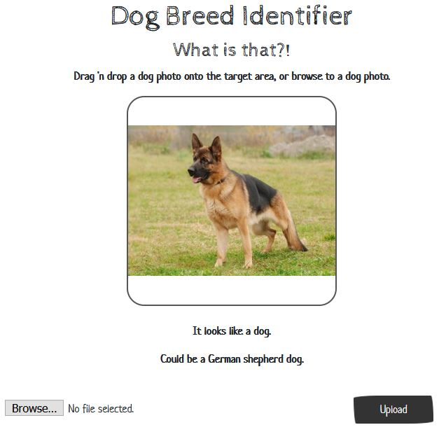

Dog Breed Identifier
======
**Dog Breed Identifier** is a program for predicting dog breeds from photos.  Just upload a photo, and it will do the rest!

#### Screenshot


## System requirements

- Windows or Linux workstation
- Firefox browser
- Miniconda or Anaconda

## Setup

First we'll need to set up the Python environment.  Open a Conda terminal, and copy/paste in this one-liner:

```
$ conda create -n woof python=3.6 tensorflow=1.10 keras flask opencv pillow numpy
```

This may take awhile.  When it completes, activate the new environment:

```
$ conda activate woof
```

Change the environment name to whatever you wish.  The application will run with newer versions of python and tensorflow, but there will be a lot of runtime warnings.  These versions keep things reasonably quiet.

(**Note to grader:**  A YAML file could have been used here, but there are already a several configuration files in the `requirements` folder.  Doing it this way seemed simpler.)

It's assumed that the Git repository has already been cloned.  If not, do so now.

```
$ git clone https://github.com/PaulNWms/dog-project.git
```

The app also requires the [Inception bottleneck features](https://s3-us-west-1.amazonaws.com/udacity-aind/dog-project/DogInceptionV3Data.npz), which is quite a large file.  Download it to the dog-project/bottleneck_features folder.

Now we're ready to start the web server.

```
$ cd dog-project/web
$ python run.py
```

The server will initialize, and then provide a link, similar to this:

```
Using TensorFlow backend.
 * Serving Flask app "run" (lazy loading)
 * Environment: production
   WARNING: This is a development server. Do not use it in a production deployment.
   Use a production WSGI server instead.
 * Debug mode: off
 * Running on http://127.0.0.1:5000/ (Press CTRL+C to quit)
 ```

Open a Firefox browser and copy/paste the link onto the address bar.

(**Note to grader:** If it happens to run on any other browsers, that's purely by accident.)

## Usage

To use the website, follow the instructions on the landing page.

## Contributors

Paul Williams

## Contact

* e-mail: paulwilliams_redmond@hotmail.com

